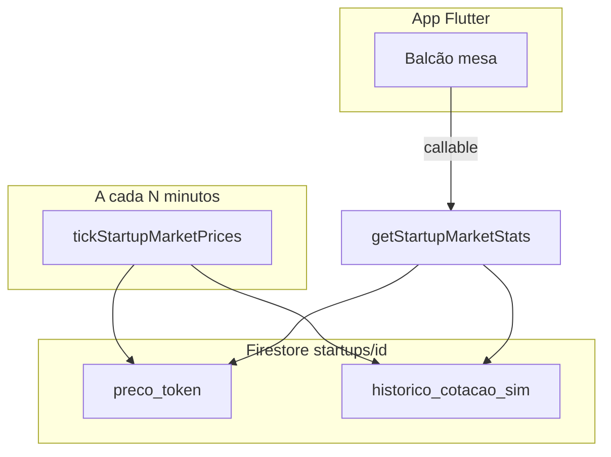

# Simulação de variação do preço do token (`historico_cotacao_sim`)

Este documento explica, passo a passo, como o projeto MesclaInvest **simula** a cotação do token em BRL **sem** blockchain nem bolsa real — adequado a um curso de Engenharia de Software (nível introdutório / 3.º semestre).

## Objetivo pedagógico

- Dar **sensação de mercado vivo**: o preço muda ao longo do tempo.
- Manter **uma única fonte de verdade** para negócios: o campo Firestore `preco_token` no documento `startups/{id}` (o mesmo valor que `simulateWallet` lê nas compras/vendas).
- Controlar **custos** na Firebase: o intervalo padrão é **20 minutos** entre atualizações (menos execuções do que a cada 2 minutos).

## Componentes principais

| Ficheiro | Função |
|----------|--------|
| [`marketSimulationConfig.ts`](../shared/marketSimulationConfig.ts) | Intervalo do Scheduler (`MARKET_TICK_SCHEDULE`), tamanho máximo do histórico, amplitude máxima do movimento (`MARKET_MAX_PRICE_STEP_PCT`). |
| [`marketPriceStep.ts`](../shared/marketPriceStep.ts) | Função pura `nextSimulatedTokenPriceBrl`: calcula o próximo preço a partir do anterior (fácil de testar). |
| [`tickStartupMarketPrices.ts`](tickStartupMarketPrices.ts) | Função **agendada** (Cloud Scheduler): percorre todas as startups e atualiza preço + histórico. |
| [`getStartupMarketStats.ts`](getStartupMarketStats.ts) | Callable usada pelo app no **Balcão**: devolve preço atual, min/máx 24h e série para o gráfico. |

## Fluxo resumido

1. O **Scheduler** dispara `tickStartupMarketPrices` no horário configurado (por defeito `every 20 minutes`).
2. Para cada documento em `startups`:
   - lê `preco_token` atual;
   - calcula um novo valor com `nextSimulatedTokenPriceBrl` (variação aleatória **limitada** em percentagem);
   - grava de volta `preco_token`;
   - acrescenta um ponto `{ t: Timestamp, p: número }` ao array `historico_cotacao_sim`, mantendo no máximo **300** pontos (evita documentos gigantes).
3. Na **mesa do Balcão**, o cliente chama `getStartupMarketStats`:
   - se existirem **≥ 2** pontos em `historico_cotacao_sim`, usa-os para a série e para min/máx/variação 24h;
   - caso contrário, usa o **fallback** antigo baseado em `grafico_valuation.diario` (proporcional ao valuation), útil antes do primeiro tick ou sem dados simulados.

## Algoritmo do próximo preço (simplificado)

Seja `prev` o último `preco_token` válido:

1. Sorteia-se um número uniforme `u` em `[-1, 1]`.
2. Define-se `factor = 1 + u * MAX_RELATIVE_STEP`, onde `MAX_RELATIVE_STEP` vem da config (por defeito **1,2 %** por tick: `0,012`).
3. `next = prev * factor`, com arredondamento e piso mínimo positivo.

Assim o preço **oscila** sem saltos enormes entre dois ticks consecutivos.

## Como alterar o intervalo ou a amplitude

As variáveis são lidas do ambiente no **deploy** das functions (ou no emulador, via `.env` / `firebase functions:config` conforme o vosso projeto):

| Variável | Significado | Exemplo |
|----------|-------------|---------|
| `MARKET_TICK_SCHEDULE` | Expressão do Cloud Scheduler | `every 20 minutes` |
| `MARKET_MAX_PRICE_STEP_PCT` | Maior variação **relativa** por tick, em **percentagem** | `1.2` → ±1,2 % |

Alterar estes valores **exige novo deploy** das Cloud Functions para produção.

## Relação com outras functions do módulo wallet

- **`simulateWallet`**: continua a ler `preco_token` **no momento** da operação; quando o scheduler atualiza o campo, o próximo trade usa automaticamente o novo preço.
- **`getWalletTokenPerformance`**: analisa o **ledger** do usuário (compras/vendas); não depende do scheduler, mas o usuário beneficia de preços diferentes ao longo do tempo nas operações.
- **`getStartupMarketStats`**: voltado ao **mercado** (gráfico + min/máx); passa a preferir `historico_cotacao_sim` quando disponível.

## Testes

- `marketPriceStep.unit.test.ts` — valida o cálculo do próximo preço com gerador pseudoaleatório fixo.

Para validar o Scheduler localmente, usar emulador Firebase com functions e disparar o job manualmente ou temporariamente usar intervalo curto só em desenvolvimento.
